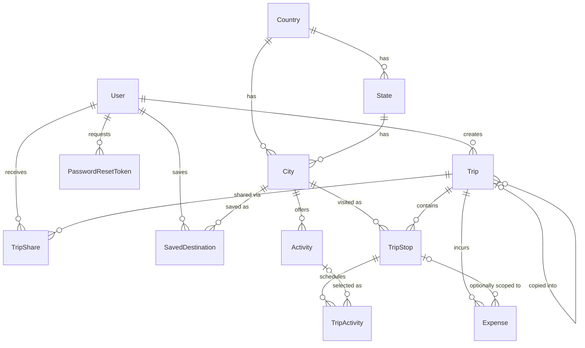

# GlobeTrotter — Database Design

This document explains **how the GlobeTrotter database is structured and why**. It is written to be read top-to-bottom by someone who has never seen the project.

Stack: **PostgreSQL + Prisma ORM**
Schema file: `prisma/schema.prisma`

---

## 1. The core idea: three layers of data

Every table in this database belongs to exactly one of three layers. If you understand this split, the rest of the schema follows naturally.

| Layer | What it is | Tables | Who creates it |
|---|---|---|---|
| **Master data** | Facts about the world that exist before any user signs up | `Country`, `State`, `City`, `Activity` | Seeded by us |
| **Trip data** | What a specific user planned | `Trip`, `TripStop`, `TripActivity`, `Expense` | Created by users |
| **Social data** | Who can see whose trip | `TripShare`, `Trip.visibility`, `SavedDestination` | Created by users |
| **Auth data** | Identity and account recovery | `User`, `PasswordResetToken` | Created by users |

The single most important rule that comes out of this:

> **User data may be deleted. Master data may not.**

Delete a trip → its stops, activities and expenses go with it (`onDelete: Cascade`).
Delete a city → **blocked** (`onDelete: Restrict`), because hundreds of trips may point at it.

---

## 2. The full picture



A worked example that touches almost every table:

```
User: Nishkal
 └── Trip: "Himachal Trip"  (10 Dec → 18 Dec, ₹30,000)
      │
      ├── TripStop 1: Delhi     (10–11 Dec)
      │    └── TripActivity: India Gate
      │
      ├── TripStop 2: Manali    (12–15 Dec)
      │    ├── TripActivity: Skiing      ₹2,500
      │    ├── TripActivity: Solang Valley
      │    └── Expense: Hotel            ₹6,000
      │
      └── TripStop 3: Shimla    (16–18 Dec)
           └── TripActivity: Mall Road

      Expense (no stop): Delhi flights    ₹8,000
```

---

## 3. Table-by-table

### `User`

Login and profile. Passwords are stored as `passwordHash` only — the raw password never touches the database.

`role` is a `UserRole` enum (`USER` / `ADMIN`). This is what gates the admin analytics dashboard. There is no separate admin table; a role column is enough for two roles.

### `Country` → `State` → `City`

A three-level hierarchy of master data.

**Why separate these out instead of storing `"India"` as a string on every row?**

1. **No typos.** `"India"`, `"india"`, `"Inida"` become three different countries if you store strings.
2. **Filtering works.** "Filter by country/region" is a required feature. Filtering on a foreign key is fast; filtering on free text is not.
3. **One place to edit.** Fixing a city's name fixes it everywhere.

**Why is `stateId` required and not optional?**

This is subtle and worth knowing. The uniqueness rule is `@@unique([countryId, stateId, name])` — one city name per state per country.

But **PostgreSQL treats `NULL` as "unknown", and two unknowns are never considered equal.** So if `stateId` were nullable, you could insert `(India, NULL, "Manali")` a hundred times and the unique constraint would never fire — defeating the whole purpose of the table.

Solution: `stateId` is required. For city-states or countries without meaningful regions, seed a placeholder state (`Singapore` → state `Singapore`).

### `Trip`

The container. Name, dates, optional budget, cover image, and `visibility`.

`copiedFromTripId` is a **self-relation** — a Trip pointing at another Trip. It records where a copied trip came from, which gives us a "most copied trips" metric for free on the admin dashboard. It uses `onDelete: SetNull`, so deleting the original does **not** delete the copy — it just forgets the link.

`currency` defaults to `INR` but exists because the product talks about global destinations.

### `TripStop` — the most important table

`City` is a fact about the world. `TripStop` is **"this user chose this city, for these dates, as step N of this trip."**

**Why not just put `cityId` on `Trip`?** Because a trip has *many* cities. `TripStop` is the join table between `Trip` and `City`, but it is more than a join table — it carries its own data (`sequence`, `startDate`, `endDate`, `budget`).

**The `sequence` column and reordering**

`sequence` is an integer: 1, 2, 3. It is deliberately **not** under a unique constraint.

Here's why. Suppose you have stops at sequence 1, 2, 3 and the user drags stop 3 above stop 2. To swap them you must `UPDATE` one row first. The instant you write `sequence = 2` on the third stop, two rows hold the value 2 — and a unique constraint would reject the write, even though the *final* state would have been perfectly valid.

Postgres unique constraints can be made deferrable (checked at commit instead of per-statement), but Prisma doesn't expose that. So:

> **Reordering = renumber all stops of that trip inside a single transaction.**

At 5–15 stops per trip this costs nothing.

### `Activity` vs `TripActivity`

This pair confuses people, so read this section twice.

- **`Activity` is master data.** "Skiing exists in Manali and typically costs ₹2,000." Seeded by us, shared by all users, searchable.
- **`TripActivity` is a user's choice.** "Nishkal is skiing on 13 Dec at 10:00 AM and budgeted ₹2,500 for it."

When a user clicks *Add Activity*, we **never modify the master `Activity` row.** We create a `TripActivity` that points at it.

**Why does `TripActivity` have its own `estimatedCost`?**

Because master data changes and history must not. If skiing's `defaultCost` is updated from ₹2,000 to ₹3,500 next season, every past trip's budget would silently rewrite itself. Copying the cost into `TripActivity` at planning time freezes it. This is called a **snapshot** (or point-in-time copy), and it's the same reason an invoice stores the price paid rather than linking to the current product price.

**Custom activities**

`activityId` is nullable and `customName` exists, so a user can add "Dinner with cousin" that isn't in our master list. The rule *at least one of the two must be set* cannot be expressed in Prisma, so it's a raw SQL `CHECK` constraint (see §5).

**Time storage**

`activityDate` is the day. `startMinute` is an `Int` — minutes after midnight (600 = 10:00 AM).

Why not a `DateTime` for the start time? Because a `DateTime` carries its own date, which can drift out of sync with `activityDate` and put the activity on the wrong day in the calendar view. One date field, one time-of-day integer, no contradiction possible.

`sequence` orders activities within a day, for untimed items and drag-to-reorder.

### `Expense`

Hotel, food, transport, and miscellaneous costs.

- `tripId` is **required**
- `stopId` is **optional**

That combination is the point. A hotel bill belongs to a stop. A round-trip flight or travel insurance belongs to the *whole trip* and to no single city. Making `stopId` optional lets both exist.

**`ExpenseCategory` has no `ACTIVITY` member — on purpose.**

Activity costs live in `TripActivity.estimatedCost`. If activities could *also* be logged as expenses, the same ₹2,500 would be counted twice and the budget screen would be wrong. One cost, one home:

```
Trip total = SUM(TripActivity.estimatedCost)   -- activities
           + SUM(Expense.amount)               -- everything else
```

### `TripShare` and `Trip.visibility`

Visibility has three states:

| Value | Who can see it |
|---|---|
| `PRIVATE` | Owner only |
| `SHARED` | Owner + users listed in `TripShare` |
| `PUBLIC` | Anyone with the link |

**There is no `PublicTrip` table.** A public trip is just a `Trip` with `visibility = PUBLIC`. Adding a table would duplicate every column for no benefit.

`TripShare` grants `VIEW` permission only — the requirement says shared users are read-only. The `Permission` enum has a single value today, which makes adding `EDIT` later a one-line change instead of a schema migration.

### `SavedDestination`

A wishlist. `@@unique([userId, cityId])` means you can't save the same city twice.

### `PasswordResetToken`

Stores `tokenHash`, never the raw token. If the database leaks, the hashes are useless for resetting anyone's password. `expiresAt` bounds the window; `usedAt` makes a token single-use.

---

## 4. Delete behaviour at a glance

| Relation | Behaviour | Reasoning |
|---|---|---|
| `User` → `Trip` | Cascade | Delete account, delete their trips |
| `Trip` → `TripStop` | Cascade | Stops are meaningless without the trip |
| `TripStop` → `TripActivity` | Cascade | Remove Manali, remove skiing |
| `TripStop` → `Expense` | Cascade | Remove Manali, remove its hotel bill |
| `Trip` → `Expense` | Cascade | — |
| `City` → `TripStop` | **Restrict** | Can't delete a city trips depend on |
| `Activity` → `TripActivity` | **Restrict** | Can't delete an activity trips reference |
| `Country`/`State` → `City` | **Restrict** | Protect the hierarchy |
| `Trip` → copied `Trip` | SetNull | Delete the original, the copy survives |

---

## 5. Rules the schema can't enforce by itself

Two invariants live outside Prisma. Both must be handled or the data can go bad.

**A. A `TripActivity` must have a name**

Prisma has no `CHECK` syntax. Add it in a raw migration:

```bash
npx prisma migrate dev --create-only --name trip_activity_check
```

Then paste into the generated SQL before applying:

```sql
ALTER TABLE "TripActivity"
ADD CONSTRAINT "trip_activity_name_required"
CHECK ("activityId" IS NOT NULL OR "customName" IS NOT NULL);
```

**B. An expense's stop must belong to its trip**

Nothing at the database level prevents `Expense(tripId = A, stopId = a stop of trip B)`. Enforce in the service layer:

```js
if (stopId) {
  const stop = await tx.tripStop.findUnique({ where: { id: stopId } });
  if (!stop || stop.tripId !== tripId) {
    throw new Error('Stop does not belong to this trip');
  }
}
```

---

## 6. Transactions (where ACID actually matters)

Three operations write multiple tables and must be all-or-nothing.

**Create trip with stops** — a trip saved without its stops is a broken trip.

**Reorder stops** — renumbering must not leave half the stops on old sequence values.

**Copy trip** — the big one:

```
BEGIN
  create new Trip (copiedFromTripId = original.id)
  copy all TripStops
  copy all TripActivities
  copy all Expenses
COMMIT
```

If this fails at the activities step, a rollback prevents a half-built trip appearing in the user's list. After copy the two trips are fully independent — the original's owner deleting an activity does not affect the copy.

```js
await prisma.$transaction(async (tx) => {
  const newTrip = await tx.trip.create({ ... });
  // ... stops, activities, expenses
});
```

---

## 7. Indexes and the queries they serve

Indexes exist to serve real queries, not to decorate the schema.

| Index | Query it serves |
|---|---|
| `Trip [userId, startDate]` | "My Trips" list, sorted by date |
| `Trip [visibility, startDate]` | Public trip discovery feed |
| `TripStop [tripId, sequence]` | Load an itinerary in order |
| `TripActivity [stopId, activityDate, sequence]` | Day-wise itinerary view — one index covers all three sort keys |
| `Expense [tripId, expenseDate]` | Budget breakdown screen |
| `City [countryId]`, `[stateId]` | Filter city search by country/region |
| `City [popularity]` | "Recommended destinations" on the dashboard |
| `Activity [cityId]`, `[category]` | Activity search and its filters |

**Known limitation:** `@@index([name])` on `City` is a standard B-tree, which only helps prefix matches (`manali%`). A substring search (`ILIKE '%anal%'`) will ignore it and scan the table. Acceptable at seed-data scale. To fix properly, enable `pg_trgm` and add a GIN index.

---

## 8. API surface this schema supports

```
POST   /trips
POST   /trips/:tripId/stops
PATCH  /trips/:tripId/stops/reorder
GET    /cities?search=manali&countryId=...
GET    /cities/:cityId/activities
POST   /stops/:stopId/activities
POST   /trips/:tripId/expenses
GET    /trips/:tripId/itinerary
GET    /trips/:tripId/budget
POST   /trips/:tripId/share
POST   /trips/:tripId/copy
```

---

## 9. Setup

```bash
npm install
npx prisma validate          # parse-check without touching the DB
npx prisma migrate dev       # apply migrations
npx prisma db seed           # load countries, states, cities, activities
npx prisma studio            # visual browser
```

Seed order matters, because of the `Restrict` foreign keys:

```
Country → State → City → Activity
```

---

## 10. Trade-offs we accepted

| Decision | Gained | Gave up |
|---|---|---|
| `sequence` not unique | Reordering works without deferrable constraints | DB won't catch duplicate sequences; app must renumber correctly |
| `Expense.tripId` denormalised alongside `stopId` | Budget queries hit one table, no join through stops | Needs an app-level check that stop belongs to trip |
| Cost snapshot on `TripActivity` | Historical trips stay accurate | Master price updates don't propagate to existing trips |
| `stateId` required on `City` | Uniqueness actually enforced | Must seed placeholder states for city-states |
| No `PublicTrip` table | Simpler schema, one source of truth | Public feed queries filter on an enum rather than reading a dedicated table |
| Role as an enum on `User` | Trivial to implement | Won't scale past a handful of roles; real RBAC needs role and permission tables |
