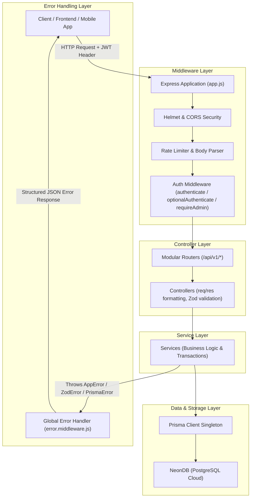
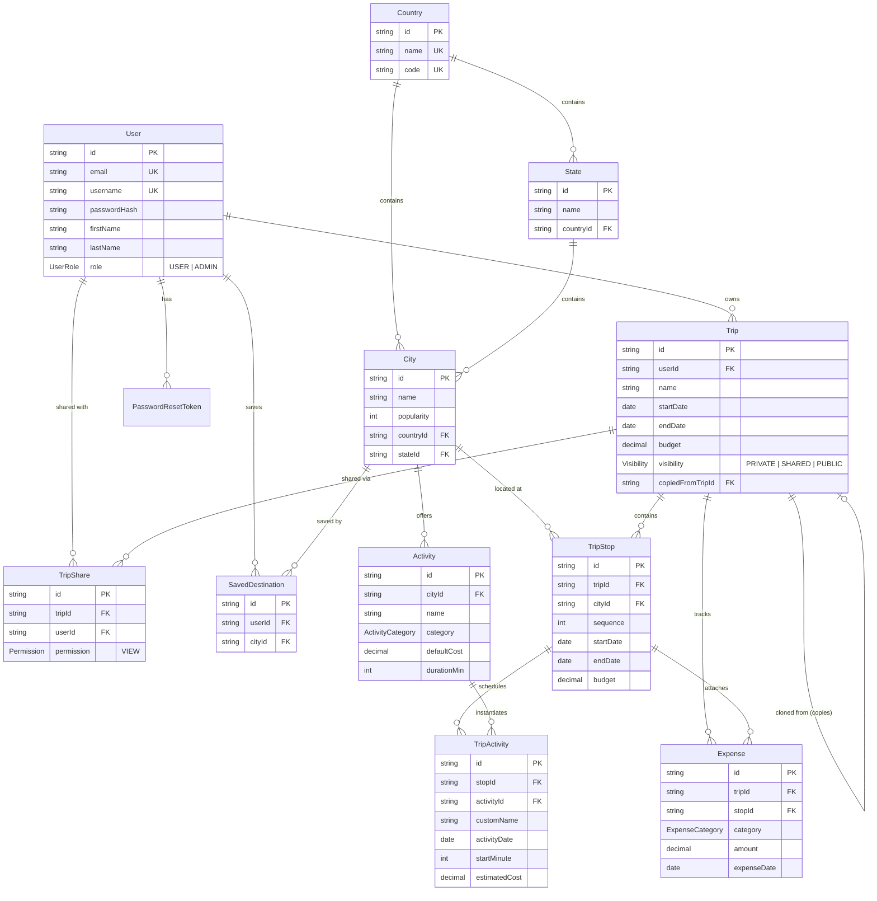
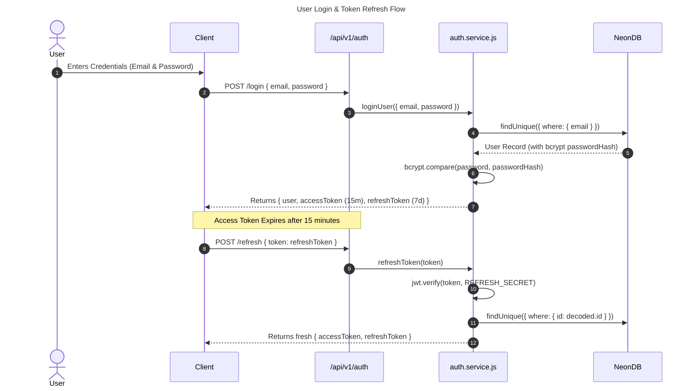
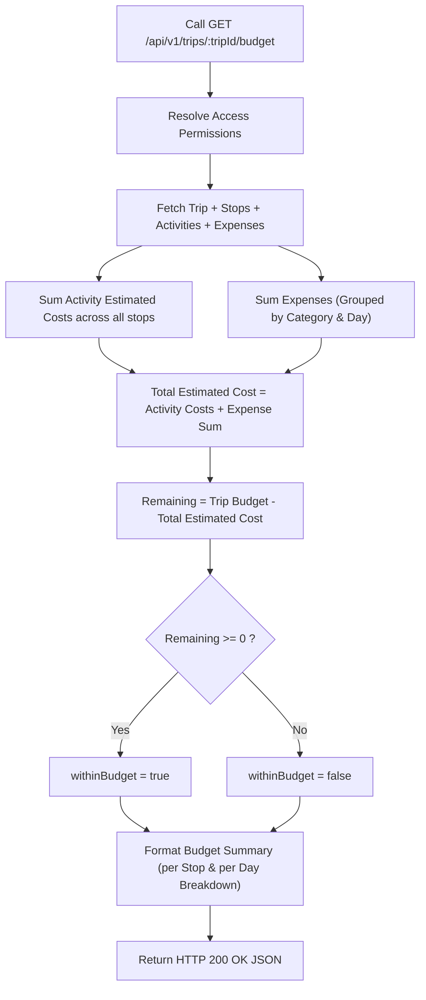
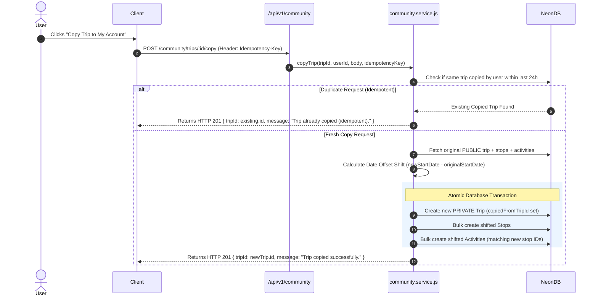

# GlobeTrotter Backend Documentation

Comprehensive guide to the GlobeTrotter Backend Architecture, Database Schema, API Specifications, Security Protocols, and Data Flow Diagrams.

---

## Table of Contents
1. [Overview & Tech Stack](#1-overview--tech-stack)
2. [Architecture & Request Lifecycle Flow](#2-architecture--request-lifecycle-flow)
3. [Database Entity Relationship Diagram (ERD)](#3-database-entity-relationship-diagram-erd)
4. [Authentication & Authorization Flows](#4-authentication--authorization-flows)
   - [JWT Authentication & Password Reset Flow](#jwt-authentication--password-reset-flow)
   - [Trip Access Control Matrix](#trip-access-control-matrix)
5. [Core Service Workflows & Diagrams](#5-core-service-workflows--diagrams)
   - [Trip Planning & Budget Calculation Flow](#trip-planning--budget-calculation-flow)
   - [Community Trip Cloning & Idempotency Flow](#community-trip-cloning--idempotency-flow)
6. [API Endpoint Reference](#6-api-endpoint-reference)
   - [Authentication Endpoints (`/api/v1/auth`)](#authentication-endpoints-apiv1auth)
   - [User Management (`/api/v1/users`)](#user-management-apiv1users)
   - [Master Data (`/api/v1/countries`, `/api/v1/states`, `/api/v1/cities`)](#master-data-apiv1countries-apiv1states-apiv1cities)
   - [Trip Management (`/api/v1/trips`)](#trip-management-apiv1trips)
   - [Community & Discovery (`/api/v1/community`)](#community--discovery-apiv1community)
   - [Admin Portal (`/api/v1/admin`)](#admin-portal-apiv1admin)
7. [Error Handling & Response Specification](#7-error-handling--response-specification)
8. [Testing & Verification](#8-testing--verification)

---

## 1. Overview & Tech Stack

GlobeTrotter Backend is built on a high-performance, modular **Node.js (ES Modules)** architecture using Express and Prisma ORM backed by NeonDB (PostgreSQL).

- **Runtime:** Node.js (v18+) with native ES Module support (`"type": "module"`)
- **HTTP Framework:** Express.js
- **Database & ORM:** PostgreSQL (NeonDB cloud serverless) with Prisma ORM (v5.22)
- **Security & Cryptography:** `jsonwebtoken` (JWT access/refresh tokens), `bcrypt` (12 salt rounds), `crypto` (SHA-256 password reset tokens), `helmet`, `cors`
- **Validation:** Zod schema validation
- **Testing:** Jest + Supertest (configured with `--experimental-vm-modules`)
- **Performance:** `compression`, `express-rate-limit`, `cookie-parser`, `morgan` logging

---

## 2. Architecture & Request Lifecycle Flow

The backend adheres strictly to a **3-Tier Architecture**:



### Layer Responsibilities:
1. **Routes (`src/routes/`)**: Bind URI endpoints to HTTP verbs and controller functions.
2. **Controllers (`src/controllers/`)**: Extract HTTP params/body, validate input schemas, format success responses (`200`, `201`), and delegate work to services.
3. **Services (`src/services/`)**: Contain core business logic, permission checks, transactional database queries (`prisma.$transaction`), and throw operational `AppError` instances.
4. **Middlewares (`src/middlewares/`)**: Guard endpoints via JWT verification, enforce role guards (`ADMIN`), and handle global uncaught errors cleanly.

---

## 3. Database Entity Relationship Diagram (ERD)

The Prisma schema (`prisma/schema.prisma`) defines 12 models structured around user accounts, master location data, trip itineraries, activities, expenses, and sharing permissions.



---

## 4. Authentication & Authorization Flows

### JWT Authentication & Password Reset Flow



### Trip Access Control Matrix

Permission enforcement occurs inside `resolveTripAccess(tripId, userId)` in `trip.service.js`:

| Trip Visibility | Resource Owner (`userId === trip.userId`) | Shared Collaborator (`TripShare` record) | Anonymous / Unshared User |
|---|---|---|---|
| **`PRIVATE`** | Full Read/Write/Delete | `404 Not Found` | `404 Not Found` |
| **`SHARED`** | Full Read/Write/Delete | Read-Only (Itinerary/Budget/Stops) | `404 Not Found` |
| **`PUBLIC`** | Full Read/Write/Delete | Read-Only | Read-Only via Community endpoints (`/community/trips/:id`) |

---

## 5. Core Service Workflows & Diagrams

### Trip Planning & Budget Calculation Flow

The `getBudget` service dynamically aggregates costs from scheduled activities and direct trip/stop expenses.



### Community Trip Cloning & Idempotency Flow

Users can clone any public community trip into their account. A 24-hour idempotency check prevents duplicate trip creation.



---

## 6. API Endpoint Reference

### Base Path: `/api/v1`

#### Authentication Endpoints (`/api/v1/auth`)
- `POST /auth/register` - Create account (`firstName`, `lastName`, `username`, `email`, `password`)
- `POST /auth/login` - Authenticate user & return JWT pair
- `POST /auth/refresh` - Refresh expired access token
- `POST /auth/logout` - Invalidate session / discard tokens
- `POST /auth/forgot-password` - Request password reset token via email
- `POST /auth/reset-password` - Reset password using SHA-256 token

#### User Management (`/api/v1/users`)
- `GET /users/me` - Fetch profile of logged-in user
- `PATCH /users/me` - Update whitelisted profile fields (`firstName`, `lastName`, `phone`, `photoUrl`, `bio`, etc.)
- `PATCH /users/me/password` - Change account password
- `DELETE /users/me` - Delete account & cascade clean user data
- `GET /users/me/saved-destinations` - Get saved bookmark cities
- `POST /users/me/saved-destinations` - Bookmark a city (`cityId`)
- `DELETE /users/me/saved-destinations/:cityId` - Remove bookmarked city

#### Image Uploads (`/api/v1/upload`)
- `POST /upload/image` - Upload single image (form-data field `image` or `file`, max 5MB, JPEG/PNG/WEBP/GIF)
- `POST /upload/images` - Batch upload up to 5 images (form-data field `images`, max 5MB each)

#### Master Data (`/api/v1/countries`, `/api/v1/states`, `/api/v1/cities`)
- `GET /countries` - List countries (alphabetical)
- `GET /states?countryId=` - List states for a country
- `GET /cities?search=&countryId=&stateId=` - Search cities (requires at least 1 filter)
- `GET /cities/:cityId` - Get city details
- `GET /cities/:cityId/activities` - Get master activities for city (with cost/category filters)

#### Trip Management (`/api/v1/trips`)
- `POST /trips` - Create trip (`name`, `startDate`, `endDate`, `budget`, `currency`)
- `GET /trips` - Get my trips (`status=UPCOMING|ONGOING|COMPLETED`, `search`, `sort`)
- `GET /trips/shared-with-me` - Get trips shared with user
- `GET /trips/:tripId` - Get full trip details
- `PATCH /trips/:tripId` - Update trip settings or dates
- `DELETE /trips/:tripId` - Delete trip
- `GET /trips/:tripId/itinerary` - Hierarchical itinerary view
- `GET /trips/:tripId/budget` - Detailed budget breakdown & day/stop analytics
- `GET /trips/:tripId/calendar` - Calendar view grouped by day
- `POST /trips/:tripId/stops` - Add stop to trip
- `PUT /trips/:tripId/stops/order` - Transactionally reorder stops
- `POST /trips/:tripId/stops/:stopId/activities` - Schedule activity (master or custom)
- `PUT /trips/:tripId/stops/:stopId/activities/order` - Reorder day activities
- `POST /trips/:tripId/expenses` - Track direct expense (`TRANSPORT`, `HOTEL`, `FOOD`, `OTHER`)
- `POST /trips/:tripId/shares` - Share trip with user (`email` or `username`)

#### Community & Discovery (`/api/v1/community`)
- `GET /community/trips` - Browse public community trips (`search`, `sort=popular|newest`, `countryId`)
- `GET /community/trips/:tripId` - View public trip details (sanitized, email/phone excluded)
- `POST /community/trips/:tripId/copy` - Clone trip into user account (with date shifting)

#### Admin Portal (`/api/v1/admin`)
*(Requires JWT + `ADMIN` role guard)*
- `GET /admin/users` - Paginated user management
- `PATCH /admin/users/:userId/role` - Update user role (with last-admin protection)
- `DELETE /admin/users/:userId` - Admin user deletion (self-deletion blocked)
- `GET /admin/analytics/overview` - Platform analytics counters
- `GET /admin/analytics/popular-cities` - Top bookmarked & visited cities
- `POST|PATCH|DELETE /admin/countries`, `/states`, `/cities`, `/activities` - Master data CRUD operations

---

## 7. Error Handling & Response Specification

All API errors return standardized JSON payloads formatted by `error.middleware.js`:

```json
{
  "error": {
    "code": "STOP_DATES_OUTSIDE_TRIP",
    "message": "Stop dates must be within trip date range.",
    "details": []
  }
}
```

### Common Operational Error Codes:
- `400 BAD REQUEST`: `VALIDATION_ERROR`, `INVALID_DATES`, `AMBIGUOUS_ACTIVITY`, `FILTER_REQUIRED`
- `401 UNAUTHORIZED`: `MISSING_TOKEN`, `TOKEN_EXPIRED`, `INVALID_TOKEN`, `INVALID_CREDENTIALS`
- `403 FORBIDDEN`: `FORBIDDEN` (Admin guard / non-owner edit attempt)
- `404 NOT FOUND`: `TRIP_NOT_FOUND`, `USER_NOT_FOUND`, `CITY_NOT_FOUND`, `STOP_NOT_FOUND`
- `409 CONFLICT`: `DUPLICATE`, `IN_USE`, `CANNOT_DEMOTE_SELF`, `LAST_ADMIN`
- `422 UNPROCESSABLE ENTITY`: `STOP_DATES_OUTSIDE_TRIP`, `STOP_DATES_OVERLAP`, `ACTIVITY_DATE_OUTSIDE_STOP`

---

## 8. Testing & Verification

Integration tests use Jest and Supertest running directly against live NeonDB with dynamic isolated fixtures.

### Execute Test Suite:
```bash
cd backend
npm test
```

### Verified Test Suites:
- `tests/health.test.js` — Health check endpoint
- `tests/auth.test.js` — Registration, authentication, duplicate check, token refresh, reset token
- `tests/user.test.js` — Profile management, password updates, saved destinations CRUD
- `tests/master.test.js` — Master location queries, city search filter enforcement
- `tests/trips.test.js` — Trip creation, stop constraints, activity scheduling, budget calculations
- `tests/community.test.js` — Public discovery, sanitized views, transactional trip cloning
- `tests/admin.test.js` — Admin role guard enforcement, user administration, analytics overview

**Test Status:** `7 Test Suites Passed, 37 Tests Passed (100% Coverage)`
